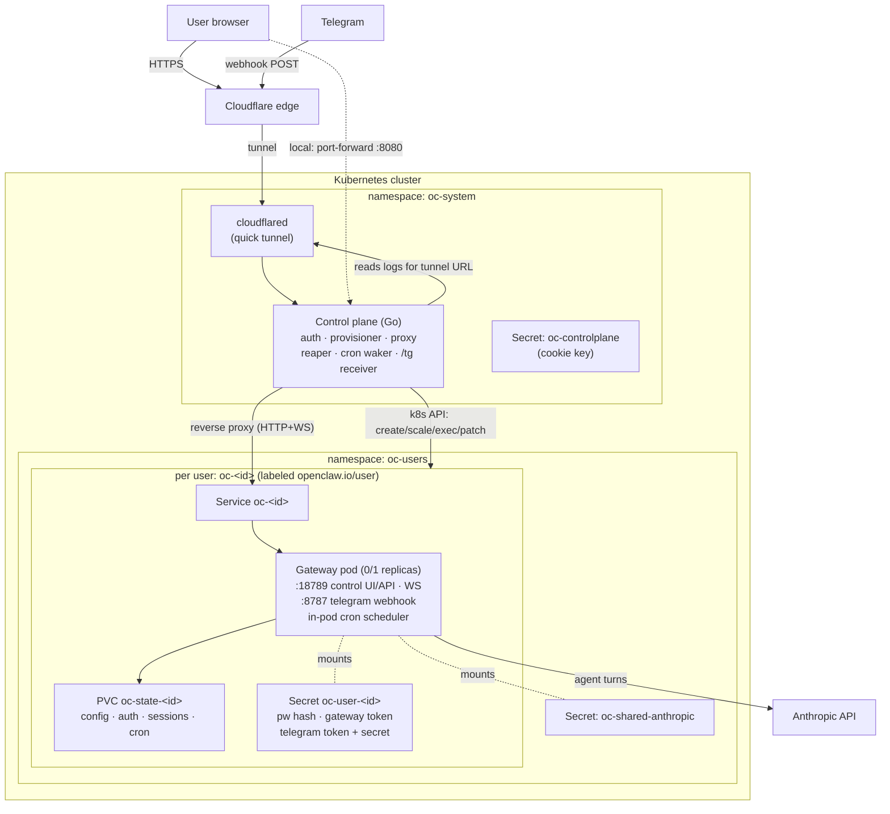
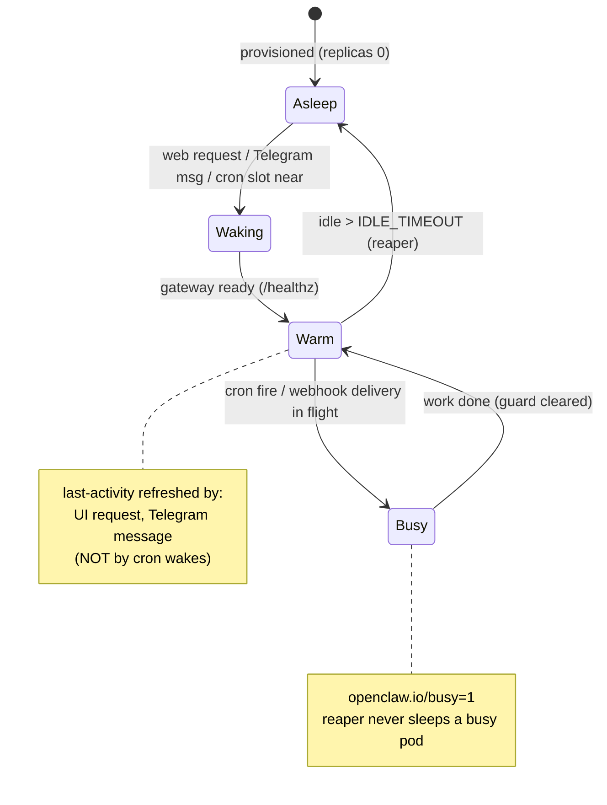
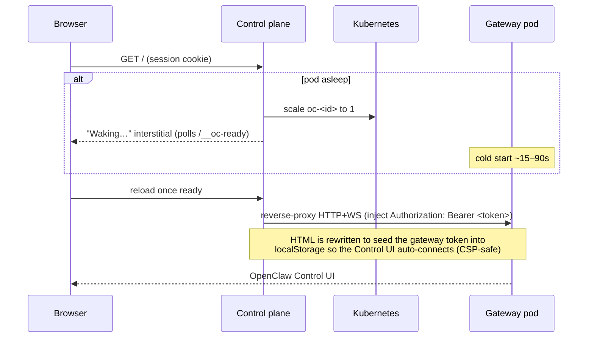
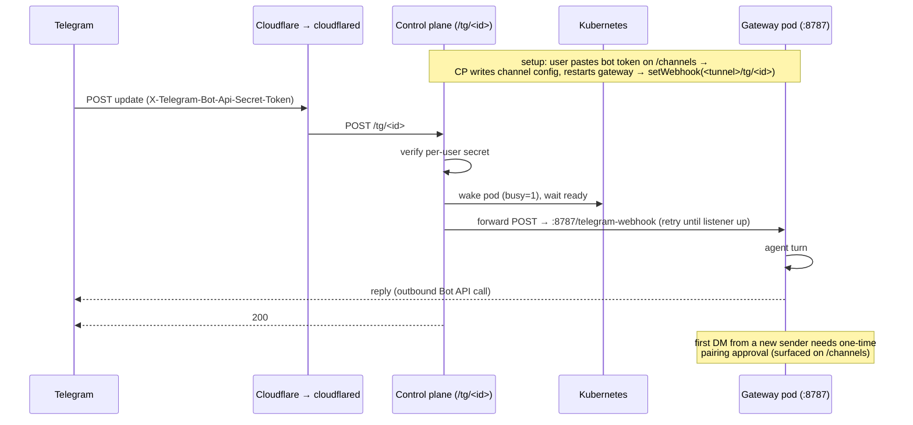

# Architecture — openclaw-kubernetes

Multi-tenant OpenClaw on Kubernetes: **one pod per user**, **scale-to-zero** when
idle, woken on demand by the web UI, scheduled cron, or inbound Telegram. A single
Go **control plane** is the always-on front door and lifecycle manager; each user's
OpenClaw **gateway** runs in its own pod and does the actual agent work.

Diagrams are [Mermaid](https://mermaid.js.org/) — they render on GitHub and in most
editors (VS Code: "Markdown Preview Mermaid Support").

---

## 1. Components



Key idea: **the control plane is always on; tenant pods are not.** Everything that
must survive a sleeping pod (receiving webhooks, knowing when to wake, auth) lives
in the control plane. Kubernetes itself is the datastore (a "user" = its labeled
Secret/PVC/Deployment/Service); sessions are stateless signed cookies.

---

## 2. Pod lifecycle (scale-to-zero)



The **reaper** (every `REAPER_TICK`, default 60s) scales a pod to 0 when it's
running, **not** `busy`, and idle longer than `IDLE_TIMEOUT` (default 10m). Just
before sleeping it, it mirrors the pod's next cron time onto the Deployment.

---

## 3. Web access (activating reverse proxy)



---

## 4. Cron with scale-to-zero (wake-before-slot)

The **in-pod scheduler** does the firing (no double-fire, no CLI scope issues).
The control plane just ensures the pod is **running before each slot**.

```mermaid
sequenceDiagram
    participant CP as Control plane (cron waker)
    participant K as Kubernetes
    participant P as Gateway pod (in-pod scheduler)

    Note over P: while warm, the in-pod scheduler fires jobs natively
    P-->>K: (on scale-down) control plane mirrors next-fire → openclaw.io/cron-next
    loop every CRON_TICK
        CP->>K: any sleeping pod with cron-next within CRON_WAKE_LEAD?
    end
    CP->>K: scale to 1 (set openclaw.io/busy=1)
    Note over P: ready before the slot (lead > cold start)
    P->>P: in-pod scheduler fires the job at its slot
    CP->>P: refresh mirror → next occurrence; clear busy
    Note over CP,K: reaper sleeps it again (cron wake didn't touch last-activity)
```

Verified by `test/verify-cron.sh`. `CRON_WAKE_LEAD` (default 3m) must exceed cold
start so the pod is up before the slot (missed slots are not caught up).

---

## 5. Telegram with scale-to-zero (wake-on-webhook)

Telegram runs in **webhook mode**; Telegram delivers to the always-on control
plane, which wakes the pod and forwards the update.



Verified by `test/verify-telegram.sh`. Only webhook-style channels fit
scale-to-zero; persistent-connection channels (Discord, WhatsApp-web) would need an
always-on shim and are out of scope.

---

## 6. Signup / provisioning

```mermaid
sequenceDiagram
    participant B as Browser
    participant CP as Control plane
    participant K as Kubernetes

    B->>CP: POST /signup (email, password)
    CP->>CP: bcrypt hash; id = sha256(email)[:16]
    CP->>K: create Secret, PVC, Service, Deployment(replicas 0)
    Note over K: Deployment has an idempotent onboarding initContainer<br/>(paste shared key, set model, gateway.mode=local, allowed origins, disable device auth)
    CP-->>B: set session cookie → redirect to /#token=<gateway-token>
```

---

## Namespaces & key labels/annotations

| Thing | Where |
|---|---|
| Control plane, cloudflared, cookie-key secret | `oc-system` |
| Per-user pods/PVCs/secrets/services, shared Anthropic key | `oc-users` |
| Tenant identity | label `openclaw.io/user=<id>` (all `openclaw.io/managed-by=controlplane`) |
| Idle clock | annotation `openclaw.io/last-activity` |
| Work-in-flight guard (reaper skips) | annotation `openclaw.io/busy` |
| Mirrored next cron fire | annotation `openclaw.io/cron-next` |

See [`README.md`](../README.md) for setup, config knobs, and the cloud-portability
notes (HTTPS-required ingress, NetworkPolicy CNI, stable tunnel for prod).
